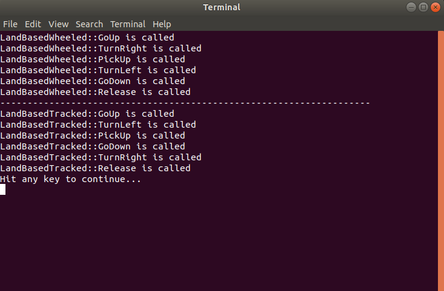

# RWA3-Group5

This is a program for developing the structure of a project that will drive robots in a maze using object-oriented programming, inheritance, and polymorphism.

It is currently hosted on GitHub at https://github.com/kulbir-ahluwalia/RWA3_Developing_structure_using_OOP

Overview
========

Output of the program is :-
(See raw code for detailed commands)

<!--For displaying image in GitHub-->

 

<!--For displaying image using Doxygen-->

